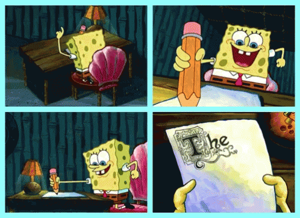
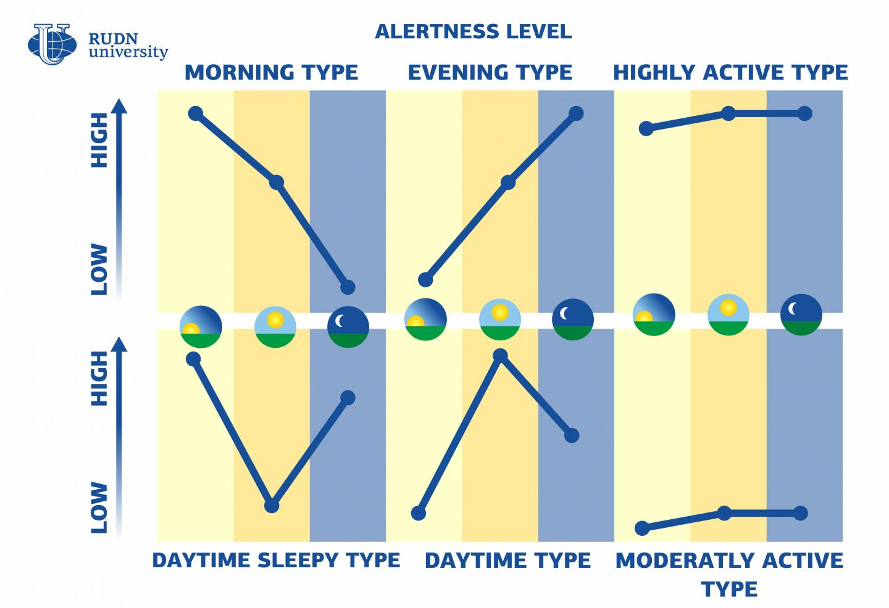

# Miracle morning

> L'avenir appartient à ceux qui se lèvent tôt"

---

### 👋 Maximilien Gilet

Développeur frontend [@Alltech](https://www.alltechconsulting.fr)

 <!-- .element: class="r-profile-picture" -->

--- 

# C'est quoi le miracle morning ?

> Encore un truc de gourou du développement personnel ?

-- 

## Ça vous arrive d'être comme ça au réveil ?

 <!-- .element: height="300" -->

--

- Tête dans le 🍑
- SNOOZE SNOOZE SNOOZE
- En retard pour tout
- Énorme flemme

-- 

### Se réveiller comme ça toute votre vie ?

Meh.

---

## Le livre qui peut vous sauver

 <!-- .element: height="400" -->

--

- Écrit par Hal Elrod
- Sortir de sa dépression
- S'offrir un supplément de vie

---

## Ok mais j'aime trop dormir

Ça tombe bien, moi aussi <!-- .element: class="fragment" -->

--

### L'idée

- Transformer le matin en moment agréable
- Profiter du calme
- Tirer meilleur profit de ce moment
- Se lever du bon pied tous les jours

-- 

### En pratique

- Se lever 1h plus tôt
- Pratiquer les "SAVERS"
- Activitées de 10 minutes

--- 

## 1. Méditation 🧘

--

- S’asseoir confortablement.
- Fermer les yeux ou regarder un point fixe
- Se concentrer sur sa respiration
- Apprécier le calme, ne penser à rien

Note: Il peut aussi s'agir d'une prière

--

### Pourquoi

- Finir de se réveiller
- Diminuer son stress
- Sérénité

Note: Il existe des applications pour vous aider à méditer comme Insight Timer, Headspace, Calm, etc.

---

## 2. Lecture 📖

--

- Profiter du calme pour lire un livre
- Pour s'évader
- Apprendre de nouvelles choses
- Développer son imagination

---

## 3. Affirmations / objectifs 🗣️

--

- Se répéter des phrases positives
  - Citations inspirantes
  - Loi d'attraction
- Se motiver <!-- .element: class="fragment" -->
- Visualiser ses objectifs <!-- .element: class="fragment" -->
  - Tâches de la journée
  - Objectifs à long terme
- Gratitude <!-- .element: class="fragment" -->

Note: Il peut s'agir d'objectifs à court terme ou à long terme. Il peut s'agir de phrases positives ou de citations inspirantes.
La loi d'attraction c’est la capacité à attirer dans nos vies ce sur quoi nous nous concentrons. Nous pouvons attirer des choses positives ou négatives par le biais du cycle : pensée, émotion, action, résultat. Aucun fondement scientifique.

--

### Pourquoi

- Se motiver
- Organiser sa journée
- Se rappeler ses objectifs

---

## 4. Écriture 📝

--

- Écrire ses pensées
- Écrire ses objectifs
- Écrire ses idées
- Écrire ses rêves
- Écrire un livre

Note: Il peut s'agir d'un journal intime, d'un journal de gratitude, d'un journal de bord, etc.

--

### Pourquoi

- Se libérer l'esprit
- Se rappeler ses objectifs ou ses idées
- Se souvenir de ses rêves

---

## 5. Exercice physique 🏃

 <!-- .element: height="300" -->

--

- Faire du sport
- Faire des étirements
- Faire du yoga
- Faire des pompes

Note: Il peut s'agir d'une activité physique intense ou non. Il peut s'agir d'une activité cardio ou de musculation. L'exposition à la lumière du jour est importante pour réguler le cycle circadien.

--

### Pourquoi

- Se réveiller
- Se sentir bien
- Garder la forme

---

## Mon retour d'expérience

--

- 6 mois de pratique
- Hâte de me lever le matin <!-- .element: class="fragment" -->
- Meilleure organisation <!-- .element: class="fragment" -->
- Meilleure productivité <!-- .element: class="fragment" -->
- Meilleure humeur <!-- .element: class="fragment" -->
- Habitudes positives <!-- .element: class="fragment" -->
- L'impression d'avoir plus de temps <!-- .element: class="fragment" -->

--

### Pourquoi j'ai arrêté :

 <!-- .element: height="300" class="fragment" -->

-- 

### Ma routine adaptée

- 10 minutes de méditation
- 40 minutes de lecture
- 10 minutes de planification
- ☕️ à la fin

---

## Mes conseils

- Habitude à prendre
  - Commencer par ce qui vous plaît
  - 3 semaines pour prendre une habitude
  - Difficile au début
- Adapter à ses contraintes <!-- .element: class="fragment" -->
- Adapter à ses préférences <!-- .element: class="fragment" -->
- Se coucher plus tôt <!-- .element: class="fragment" -->
- Ne pas commencer par un café <!-- .element: class="fragment" -->

Note: Au réveil le corps produit du cortisol, l'hormone du stress. Le café augmente la production de cortisol. Il est donc préférable d'attendre un peu avant de boire son café.

---

## À retenir

- Profiter du calme du matin
- Commencer la journée du bon pied
- Se sentir mieux

--

  

    
    <ul>
      <li>Se reveille à 8h59 pour embaucher à 9h</li>
      <li>Appuie 10x sur snooze</li>
      <li>Déteste le matin</li>
    </ul>
  

  

    
    <ul>
      <li>Profite du calme du matin</li>
      <li>Développe des habitudes vertueuses</li>
      <li>Chaque jour commence par un moment de plaisir</li>
    </ul>
  

--

### Pour aller plus loin

[Miracle Morning](https://www.miraclemorning.com/)

---

## Bonus

--

> Je suis pas du matin

 <!-- .element: height="400" -->

Chronotypes

--

### Applications

[Rise - Suivi niveaux d'énergie / sommeil](https://www.risescience.com/)

Méditation : 

- Insight Timer
- Headspace
- Calm
- Endel
